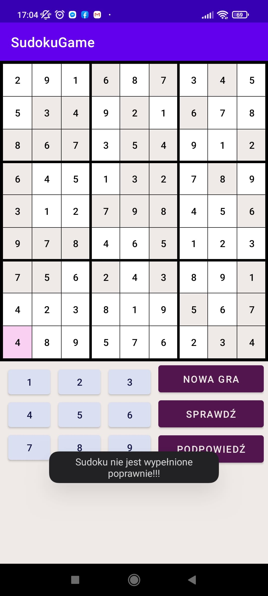

# Sudoku Game
Mobile application created with Java (Android Studio). It represents a Sudoku Game.

##Description

###Sudoku genaration algorithm
####First, a correctly filled sudoku matrix is generated. Then the board is randomly shuffled by shuffling columns and rows or using a transposition matrix. The board obtained in this way is copied. Random fields are erased on the copy of the board. This is how the sudoku board is made.

##Screen shots

###Screen shot after open application

###Screen shot after insert some numbers

###Screen shot after checking results by clicking "Sprawdź" when board is not filled

###Screen shot after clicking get hint ("Podpowiedź")

###Screen shot after checking results by clicking "Sprawdź" when board is filled wrong

###Screen shot after checking results by clicking "Sprawdź" when board is filled correct
